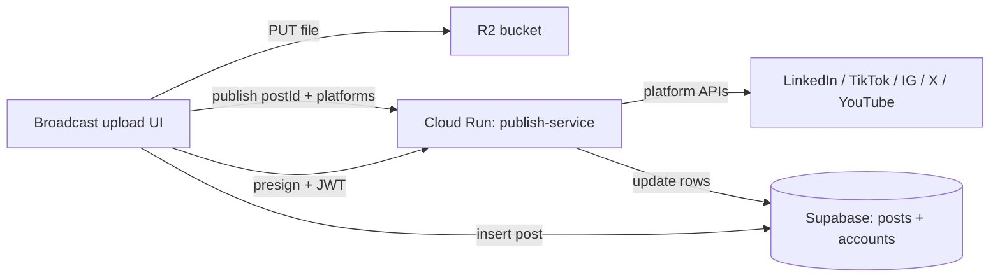

# Cross‑platform posting architecture

This document describes how media gets from the Yak Station broadcast UI into each social network **after** a user already has linked accounts stored in Supabase. It skips login, OAuth redirects, and payment setup unless they affect the publishing path.

## High‑level flow

1. **Client** (`broadcast/upload.html`) gathers caption, chosen platforms, and optional media.
2. **Media** goes to **Cloudflare R2**: the browser calls `POST /api/broadcast/publish?action=upload` with a Supabase JWT; the Cloud Run publish service returns a presigned PUT URL; the browser uploads the file directly to R2. The public URL (`R2_PUBLIC_URL` + object key) is stored on the post as `video_url` (used for images too). `metadata.r2_key`, `metadata.file_size_bytes`, and `metadata.content_type` capture the bucket key and media details for later publish/cleanup.
3. **Optional thumbnail** goes to Supabase Storage bucket `videos` (same project as posts).
4. **Post row** is inserted into Supabase table `posts` with `video_url`, `thumbnail_url`, `caption`, `platforms[]`, `metadata` (`media_type`, etc.), status (`draft` | `scheduled` | `publishing`), and empty `platform_results`.
5. **Publish** happens via `POST /api/broadcast/publish` with body `{ postId, platforms }` and the user’s Bearer token. Vercel rewrites this to the **Cloud Run publish service**, which validates the JWT, loads the post and matching `connected_accounts` rows (tokens live there—it does not walk through OAuth during publish).
6. **Results** merge into `platform_results` JSONB and `status` transitions (`publishing` → `published` | `partial` | `failed`). The UI listens on Supabase Realtime for `posts` UPDATEs while the modal is open.

## Core data model (publishing‑relevant)

| Store | Role |
|--------|------|
| `posts` | One row per cross‑platform post: `video_url`, `caption`, `platforms`, `metadata`, `platform_results`, `status`, optional `scheduled_at`. |
| `connected_accounts` | One row per user per platform: `access_token`, optional `refresh_token` / `token_expires_at`, `platform_user_id` where the API requires it (e.g. Instagram Business ID). |

`platform_results` shape is loosely `{ [platform]: { status, …per‑platform ids/urls/errors } }`. Status semantics used by the server include `success`, `error`, and **`pending`** (Instagram intermediate state).

## The publish API (`publish-service/src/index.js`)

Single file, multiple responsibilities:

- **`?action=upload`**: JWT → presigned R2 PUT, returns `{ uploadUrl, key, publicUrl }`. The service rejects uploads over **500MB**.
- **`?action=instagram-complete`**: JWT → polls Instagram Graph **container** until `FINISHED`, then **`media_publish`**, then updates merged `platform_results` and overall `posts.status`.
- **Default POST** `{ postId, platforms }`:
  - Skips platforms that already have `platform_results[*].status` in **`success`** or **`pending`** (safe retries).
  - Runs publishers **in parallel** (`Promise.allSettled`); after each platform finishes it **merges** into `platform_results` so partial progress is persisted.
  - On any success and `video_url` present, optionally **deletes** the object from R2 (using `metadata.r2_key`) or legacy Supabase `videos/` path, then nulls `video_url` while keeping thumbnail.

**Runtime:** publishing runs on Cloud Run. Browser uploads do not pass through Cloud Run memory.

### Platform adapters (inside `publish.js`)

| Platform | What it does |
|----------|----------------|
| **LinkedIn** | Resolves person URN from `userinfo`. Post types: commentary‑only **`/rest/posts`**; optional **image** or **video** via LinkedIn REST upload flows streamed from `post.video_url` / R2; if `metadata.linkedin_video_urn` is set (browser‑side LinkedIn upload path), it creates the feed post from that URN instead. |
| **TikTok** | Uses **`PULL_FROM_URL`** when `post.video_url` is present, so TikTok fetches from R2 instead of Cloud Run buffering the video. The legacy file-buffer path remains for compatibility. |
| **Instagram** | Graph **`/{ig‑user‑id}/media`** with `video_url` or `image_url` + caption (**REELS** for video). Does **not** call `media_publish` in that same request—it returns **`pending`** plus `container_id`. The browser or scheduler then calls **`instagram-complete`** so the worker can **`media_publish`** when processing finishes. **Requires publicly fetchable URLs** so Meta can pull media. |
| **Twitter/X** | **`/2/tweets`** with optional **`/1.1/media/upload`** chunked video from `video_url`, or attaches `metadata.twitter_media_id` if the client uploaded media beforehand. Failures during video upload can fall back to text‑only. |
| **YouTube** | Validates `metadata.media_type === 'video'`; refreshes OAuth if needed; resumable upload to **`youtube/v3/videos`**; adds `#Shorts` in description when missing; derives title from first caption line. |
| **Threads** | `publishToThreads` exists in the file but the main switch does **not** route to it—it is wired for future enablement. |

## Client UX details (`broadcast/upload.html`)

- Parallel work: thumbnail (if any) + R2 PUT can run together before the `posts` insert.
- **Realtime**: subscribes to `postgres_changes` on the new post row until all platforms appear in `platform_results` or the fetch Promise settles (covers missed events).
- **Instagram**: modal completion treats `pending` as a non‑fatal state; **`pollInstagramCompletion`** hits `instagram-complete` every 5s (with a maximum attempt budget).
- **Retry**: sends only failing platform names again; server preserves prior **`success`** / **`pending`** entries.

## Scheduled posts (`api/broadcast/cron/process-scheduled.js`)

- Scheduling is currently feature-flagged off in the browser (`SCHEDULING_ENABLED = false`) and no Google Cloud Scheduler job has been created.
- Google Cloud Scheduler should call Cloud Run `POST /scheduler/process` every minute with `Authorization: Bearer ${CRON_SECRET}`.
- The scheduler queries `posts` where `status = 'scheduled'` and `scheduled_at <= now`, claims each row by updating `scheduled -> publishing`, then calls the shared `publishPost()` flow.
- Scheduled Instagram publishing calls the same completion helper used by the UI so pending containers can be published without the browser staying open.

## Storage and cleanup summary

| Location | Typical use |
|----------|-------------|
| **R2** | Primary canonical media URL on the post (`video_url`). Deleted after successful publish paths that set `metadata.r2_key`. |
| **Supabase `videos`** | Thumbnails; legacy video URLs still supported by cleanup regex matching `/videos/...`. |

## Other clients

- **Legacy/mobile upload clients** should use the same R2 flow as the browser: request a signed URL via `/api/broadcast/publish?action=upload` (or the compatibility `/api/broadcast/upload` rewrite), upload the media directly to R2, then call `POST /api/broadcast/publish` with `{ postId, platforms }`. Avoid `publish/with-file` for normal uploads because it sends large media through the API service.

## Operational checklist (non‑auth)

- R2 credentials and **`R2_PUBLIC_URL`** reachable from **Instagram** / any **pull‑URL** integrations.
- Vercel function timeout vs. largest plausible video publish.
- TikTok interactive vs. cron divergence if you rely on nightly scheduled jobs.
- Instagram two‑step publishing needs the client (or something else) to keep calling **`instagram-complete`** until `success`/`error`.

---

*Generated from repository layout (`api/broadcast/publish.js`, `broadcast/upload.html`, `api/broadcast/cron/process-scheduled.js`, `broadcast/database.sql`, `vercel.json`).*
