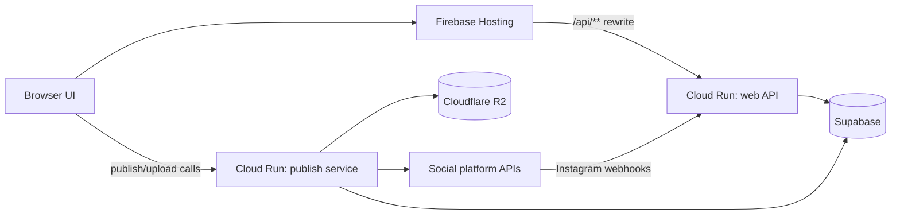

# Architecture

Lexaya is split into three runtime surfaces:

```text
Browser / Firebase Hosting
  Static HTML, CSS, and browser JavaScript
  Authenticated by Supabase client sessions

lexaya-web-api / Cloud Run
  OAuth callbacks, Stripe checkout/webhooks, Instagram webhook handling
  Uses Supabase service role for trusted server work

publish-service / Cloud Run
  Media upload signing, scheduled publishing, cross-platform publish adapters
  Uses Supabase service role and Cloudflare R2 credentials
```

## Request flow



## Important directories

| Path | Purpose |
| --- | --- |
| `api/` | Shared request handlers mounted by `web-service`. |
| `web-service/` | Express wrapper for Cloud Run web API deployment. |
| `publish-service/` | Express publish worker and social platform adapters. |
| `broadcast/` | Authenticated broadcast UI and SQL schema files. |
| `js/` | Browser config, Supabase helper, API URL helper, layout helper. |
| `scripts/` | Local build/deployment support scripts. |

## Data stores

- Supabase Auth: user sessions.
- Supabase Postgres: posts, connected accounts, automation rules, logs, subscriptions.
- Supabase Storage: legacy/static downloadable resources.
- Cloudflare R2: uploaded media that social platforms fetch by URL.

## Instagram automation flow

1. A user connects an Instagram professional account.
2. The user creates an automation rule for exactly one post/reel and one or more keywords.
3. Meta sends a comment webhook.
4. `api/_instagram.js` verifies the webhook signature, matches the professional account ID, checks the specific post ID and keyword, then sends:
   - private reply/DM;
   - public comment reply if the DM succeeds.

Instagram publishing is disabled by default. Re-enable it only if the app has `instagram_business_content_publish` approved and `INSTAGRAM_PUBLISHING_ENABLED=true`.
