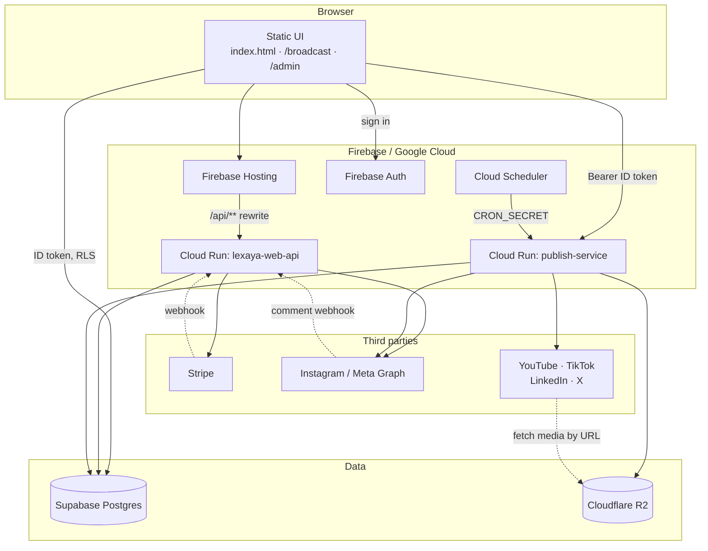
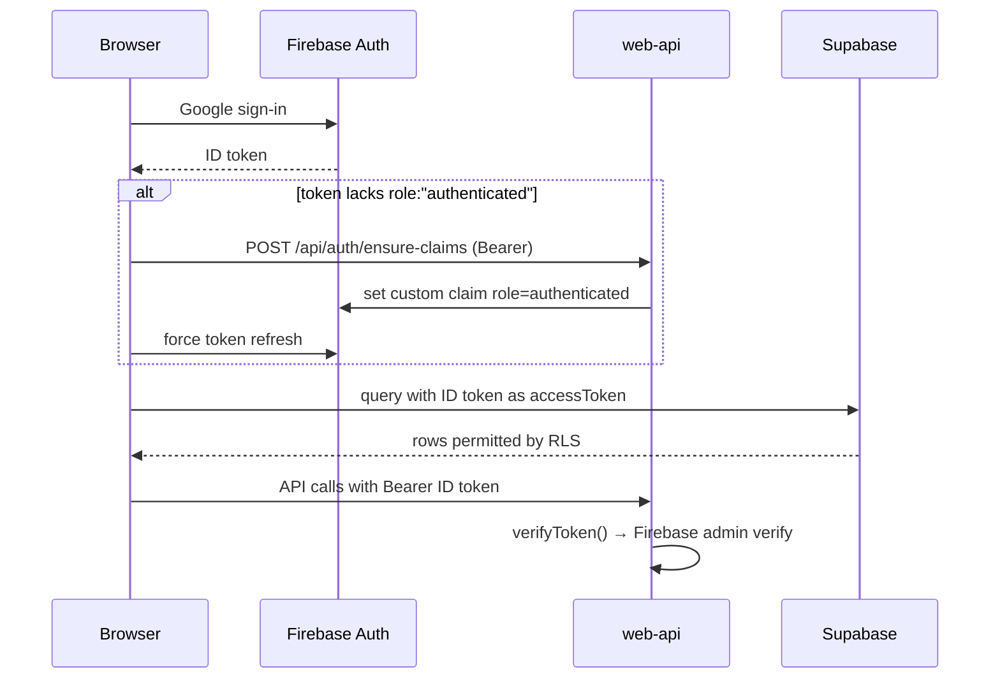
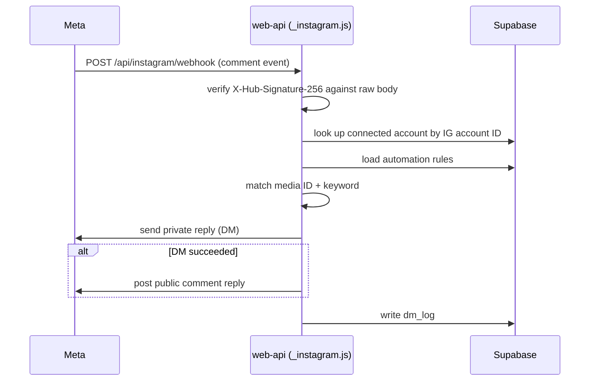
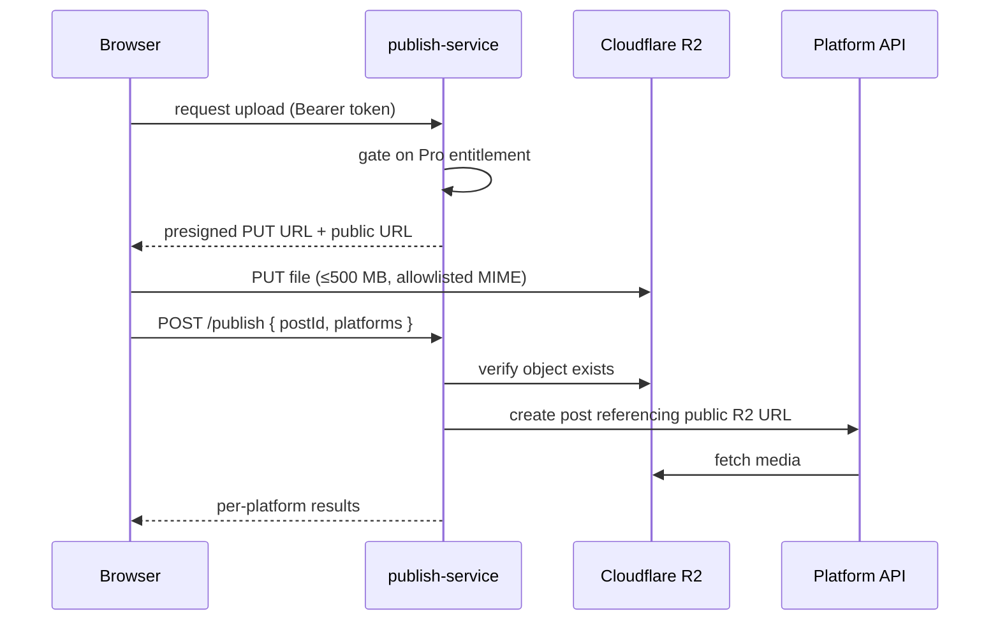

# Architecture

Lexaya is an Instagram DM automation and cross-platform publishing product. It
is a static frontend on Firebase Hosting talking to two Cloud Run services, with
Supabase Postgres as the database and Firebase Auth as the identity provider.

There is no build step for the frontend — the browser code is plain HTML, CSS,
and vanilla JavaScript served as-is.

## Stack

| Layer | Technology | Notes |
| --- | --- | --- |
| Frontend | Static HTML/CSS/vanilla JS | No bundler, no framework. Served from `.firebase-public/`. |
| Hosting | Firebase Hosting | Also rewrites `/api/**` to Cloud Run. |
| Identity | Firebase Auth (Google sign-in) | Issues the ID token used by every backend. |
| Database | Supabase Postgres | Row Level Security; browser reads it directly via third-party auth. |
| Backend API | Cloud Run — `lexaya-web-api` | Express, Node 20. Source in `api/`, wrapper in `web-service/`. |
| Publish worker | Cloud Run — `publish-service` | Express, Node 20. Media upload + platform adapters. |
| Media storage | Cloudflare R2 (S3 API) | Presigned uploads; social platforms fetch by public URL. |
| Payments | Stripe | Subscriptions + one-time digital downloads. |
| Scheduling | Cloud Scheduler | Hits `publish-service` `/scheduler/process` with `CRON_SECRET`. |

## System context



## Authentication

Firebase Auth is the single identity provider. Supabase is a database only — it
accepts the Firebase ID token through Supabase third-party auth, so the browser
can query Postgres directly under RLS without a second session.



`api/_firebase.js` still falls back to verifying a legacy Supabase access token
so pre-migration sessions keep working. That fallback is scheduled for removal.

Server-side code uses the Supabase **service role** key and bypasses RLS, so
every handler must do its own authorization — it cannot rely on the database.

## Plans and entitlements

`api/_plans.js` is the single source of truth for what is sold. The browser only
ever sends a plan key; Stripe price IDs and the capabilities each plan grants are
paired server-side, so a caller cannot pay the cheap price and claim the
expensive product.

- **Get Lexaya** — $7.99/mo — `dm_automation`
- **Lexaya Pro** — $25/mo — `dm_automation` + publishing (superset of `dm`)
- One-time digital downloads sold from `/cs` allow guest checkout.

Enforcement lives in two places, and only one of them counts:

- `js/entitlements.js` (browser) — advisory, decides what to render.
- `api/_entitlements.js` (server) — authoritative, returns `402` on failure and
  **fails closed** if the subscription lookup errors.

`publish-service` authorizes once in a global middleware rather than per route,
so a new endpoint cannot ship ungated by omission.

Access codes (`api/redeem.js`) grant free access by writing an `active`
`subscriptions` row with no Stripe IDs — from then on every entitlement check
treats the user as a payer.

## Instagram DM automation

This is the core product. A rule targets exactly one post/reel plus one or more
keywords.



Signature verification needs the exact bytes Meta sent, which is why
`web-service/src/index.js` mounts `express.raw()` on the webhook routes *before*
the global JSON parser. The Stripe webhook route does the same.

Instagram *publishing* is disabled by default and requires both
`instagram_business_content_publish` approval and
`INSTAGRAM_PUBLISHING_ENABLED=true`.

## Publishing pipeline



Scheduled posts follow the same path, triggered by Cloud Scheduler instead of
the browser. The scheduler claims each due post with a conditional update
(`status: scheduled → publishing`), so overlapping runs cannot double-publish.

Platform adapters live in `publish-service/src/platforms/`: `instagram.js`,
`youtube.js`, `tiktok.js`, `linkedin.js`, `twitter.js`.

## Data model

Schema files are in `broadcast/*.sql`. Tables:

| Table | Purpose |
| --- | --- |
| `subscriptions` | Active entitlements, from Stripe or comped via access code. |
| `connected_accounts` | OAuth tokens per user per social platform. |
| `automation_rules` | Instagram keyword → DM rules. |
| `dm_log` | Automation delivery history. |
| `posts` | Drafts, scheduled, and published posts. |
| `post_schedule_targets` | Per-platform scheduling targets for a post. |
| `webhook_subscriptions` | Meta webhook subscription state. |
| `beta_requests` | Manual Instagram beta approval queue. |
| `access_codes` / `access_code_redemptions` | Comp codes and their usage. |
| `media_kits` | Creator media kit data. |

## Repository layout

| Path | Purpose |
| --- | --- |
| `index.html`, `login.html`, `members.html` | Marketing and account pages. |
| `broadcast/` | Authenticated app UI + SQL schema files. |
| `admin/` | Admin console (access codes, beta approvals). |
| `cs/`, `kit/`, `blog/`, `resources/` | Digital products and content pages. |
| `js/` | Browser config, auth/data client, API URL and entitlement helpers. |
| `api/` | Request handlers. `_`-prefixed files are shared internals. |
| `web-service/` | Express + Docker wrapper that mounts `api/` on Cloud Run. |
| `publish-service/` | Publish worker, storage, scheduler, platform adapters. |
| `scripts/` | `build-hosting.sh`, `check.sh`. |
| `docs/` | This file, setup, configuration, deployment. |

Note that `api/` has no server of its own — `web-service/src/index.js` imports
each handler and mounts it. `scripts/build-hosting.sh` assembles
`.firebase-public/` from the static directories, excluding `*.sql` and `*.md` so
schema files and docs are never published.

## Deployment

```bash
npm run deploy          # all three, in dependency order
npm run deploy:web-api  # Cloud Run: lexaya-web-api
npm run deploy:service  # Cloud Run: publish-service
npm run deploy:site     # build-hosting.sh + firebase deploy --only hosting
```

Secrets live in Cloud Run environment config, never in the repo or the browser
bundle. `js/config.js` holds only public-safe values (Supabase anon key, Firebase
web config, Stripe publishable key). See `docs/DEPLOYMENT.md`.
